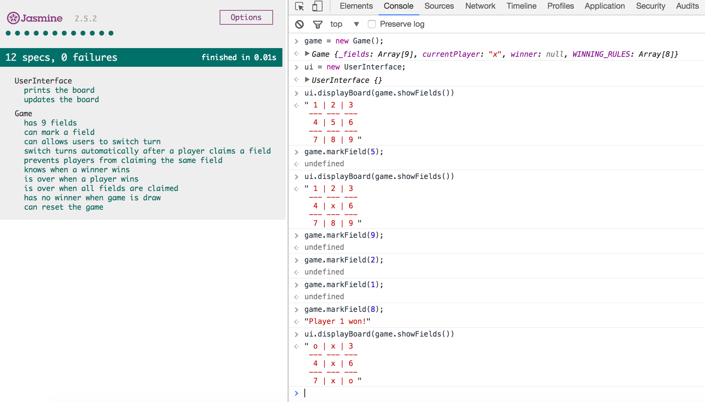

# Tic-Tac-Toe

## The Brief
Implement the business logic for tic-tac-toe:

- There are two players in the game (X and O)
- Players take turns until the game is over
- A player can claim a field if it is not already taken
- A turn ends when a player claims a field
- A player wins if they claim all the fields in a row, column or diagonal
- A game is over if a player wins
- A game is over when all fields are taken

## Approach

#### Modelling the Domain

**Game**
- has 9 fields
- marks relevant field with "x" or "o"
- allows player to claim a field
- switch turn between players
- knows the rules of the game
- knows when game is over (when there is a winner or all fields are claimed)

**Interface**
- prints board on output
- update fields on output

## Installation

- Clone this repo **git clone git@github.com:lcbeh/Tic-Tac-Toe-JS.git**
- **cd Tic-Tac-Toe-JS**
- **open SpecRunner.html** for specs
- Open console (developer's tool) on your browser to play

## Interaction example

